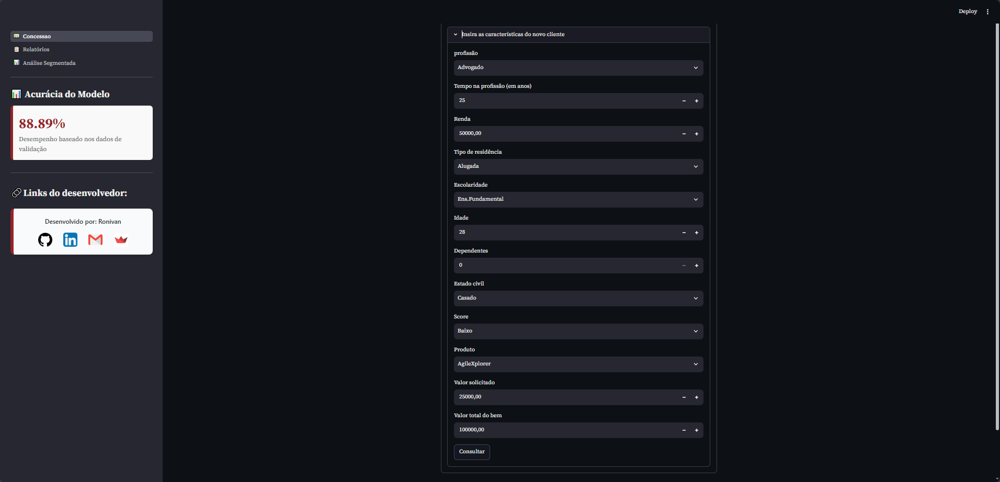

# Redução de Inadimplência em 34% com Machine Learning

Este projeto apresenta um modelo de machine learning desenvolvido para um banco que financia veículos da própria montadora. Ele identifica clientes de baixo risco e aqueles com alta probabilidade de inadimplência, permitindo decisões de crédito mais seguras e informadas.

## Objetivo
Detectar, com precisão, quais clientes são seguros e quais apresentam maior risco, contribuindo para decisões de crédito mais assertivas.

## Metodologia
Utilizamos **redes neurais** com uma acurácia de aproximadamente **9 de 10 previsões** nos dados de teste, garantindo alta confiabilidade na análise.

## Resultados
- **Inadimplência reduzida em 34%.**
- **Retorno financeiro otimizado**, evidenciado por gráficos comparativos gerados com interface dinâmica.

## Interface Interativa com Streamlit
A aplicação conta com uma interface desenvolvida em **Streamlit** que permite:
- **Uso do modelo em tempo real:** Insira dados e receba previsões instantâneas.
- **Gráficos interativos:** Visualize relatórios e gráficos dinâmicos com controles que permitem personalizar os filtros e visualizar análises comparativas.
- **Relatórios personalizados:** Ajuste os parâmetros e gere gráficos informativos que facilitam a visualização dos resultados.
- **Análise Segmentada:** Visualize as características mais relevantes para a ocorrência ou não de inadimplência.

## Ferramentas Utilizadas
- **Keras:** Criação da rede neural.
- **Matplotlib & Seaborn:** Geração de gráficos comparativos.
- **Streamlit:** Interface interativa para utilização do modelo e visualização dos resultados em tempo real.
- **FastAPI:** API de alto desempenho desenvolvida para servir o modelo de machine learning com alta disponibilidade e eficiência.

## Qualidade da API de Machine Learning

A API FastAPI (`api_fastapi.py`) é validada pelo script `teste_api_fastapi.py`, que verifica saúde do serviço, contrato dos endpoints, previsões válidas/inválidas, determinismo e latência. Os resultados ficam em `interface_and_data/` (`api_ml_test_metrics_latest.json`).

Abaixo, o último relatório de testes (execução em 24/09/2026, API v1.0.0) -> Simplificado:

| Métrica | Valor | O que isso significa |
|--------|------:|----------------------|
| Checks automatizados | 6/6 aprovados | Todos os testes passaram (health, schema, validação 422, determinismo e suite de latência). |
| Requisições de inferência | 12 | Quantidade de chamadas a `/predict` medidas na suite de latência. |
| Taxa de sucesso | 100% | Todas as previsões retornaram HTTP 200, sem falhas. |
| Taxa de erro | 0% | Nenhuma falha operacional na suite. |
| Latência média | 96,4 ms | Tempo típico para devolver uma previsão. |
| Latência p50 | 95,9 ms | Metade das respostas foi mais rápida que ~96 ms. |
| Latência p95 | 99,3 ms | 95% das respostas ficaram abaixo de ~99 ms (bom indicador de SLO). |
| Latência mín / máx | 94,5 / 100,1 ms | Faixa observada: previsões estáveis e rápidas. |
| Distribuição das classes | 9 classe 0 · 3 classe 1 | No lote de teste, o modelo classificou 9 clientes como baixo risco e 3 como alto risco (limiar 0,5). |
| Probabilidade (mín / média / máx) | 0,012 / 0,196 / 0,532 | Grau de confiança da rede (sigmoid): valores próximos de 0 = baixo risco; próximos de 1 = alto risco. |

**Leitura rápida:** a API está saudável, responde em cerca de **0,1 segundo** e devolve tanto a **classe** (`prediction`) quanto a **probabilidade** (`probability`), o que facilita auditoria e integração com a interface Streamlit.
